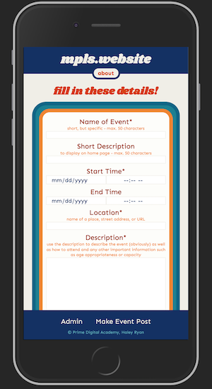

# mpls.website
## based on Prime Digital Academy's Solo Project Starter Repo

_Solo Project_

This full-stack mobile-first web application allows users to view and create public event postings. Authorized users can publish, unpublish, edit, and delete postings.





## Installation

In terminal window or editor of choice, "npm install", "run server", and "run client". Follow instructions below to set up database.

## Technologies Used

- React
- Redux
- Node
- Express
- HTML/CSS
- SQL
- Sagas
- Passport

## Dependencies

- @material-ui/core
- @material-ui/icons
- axios
- bcryptjs
- cookie-session
- dotenv
- express
- moment
- passport
- passport-local
- pg
- prop-types
- react
- react-dom
- react-redux
- react-router-dom
- react-scripts
- redux
- redux-logger
- redux-saga

## Database Setup

```SQL
--create database "mpls_website"

--user table
CREATE TABLE "user" (
    "id" SERIAL PRIMARY KEY,
    "username" VARCHAR (80) UNIQUE NOT NULL,
    "password" VARCHAR (1000) NOT NULL,
    "access_level" INT DEFAULT 1
);

--event table--there are some restrictions on character lengths and required inputs on DOM but not in db
CREATE TABLE "events" (
    "id" SERIAL PRIMARY KEY,
    "name" VARCHAR,
    "shortDescription" VARCHAR,
    "startTime" TIMESTAMP,
    "endTime" TIMESTAMP,
    "startDateString" VARCHAR,
    "startTimeString" VARCHAR,
    "endDateString" VARCHAR,
    "endTimeString" VARCHAR,
    "location" VARCHAR,
    "fullDescription" VARCHAR,
    "posterLink" VARCHAR,
    "updates" VARCHAR, 
    "hostContact" VARCHAR,
    "hostContactPublic" BOOLEAN NOT NULL DEFAULT FALSE,
    "published" BOOLEAN NOT NULL DEFAULT false,
    "flagged" BOOLEAN NOT NULL DEFAULT false
);

--notes table- references user table and events table
CREATE TABLE "notes" (
	"id" SERIAL PRIMARY KEY,
	"text" VARCHAR NOT NULL,
	"event_id" INT REFERENCES "events",
	"user_id" INT REFERENCES "user",
	"time" TIMESTAMP 
);

```

